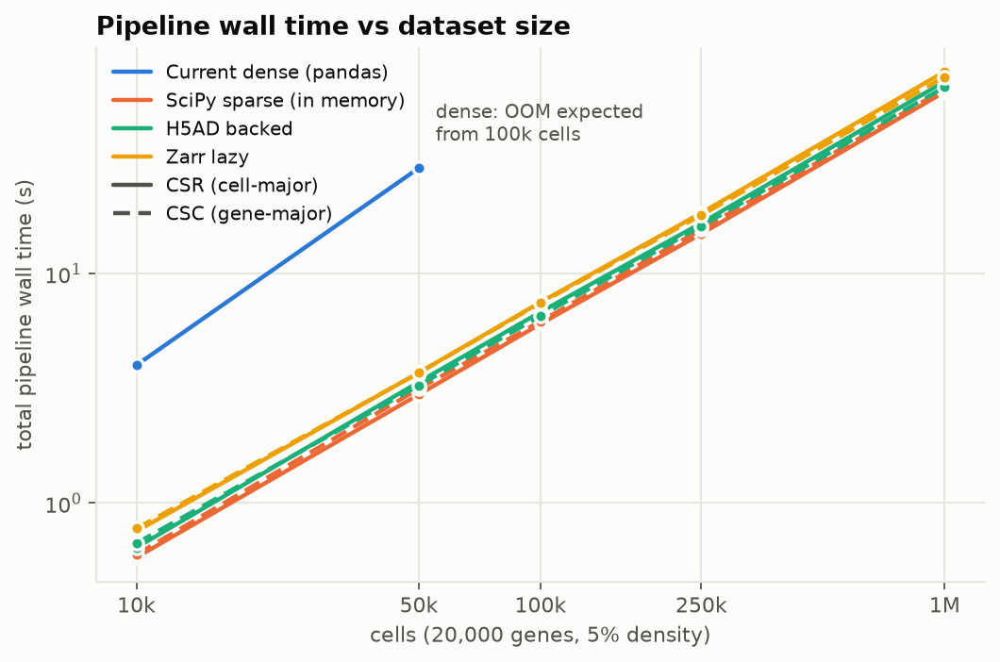
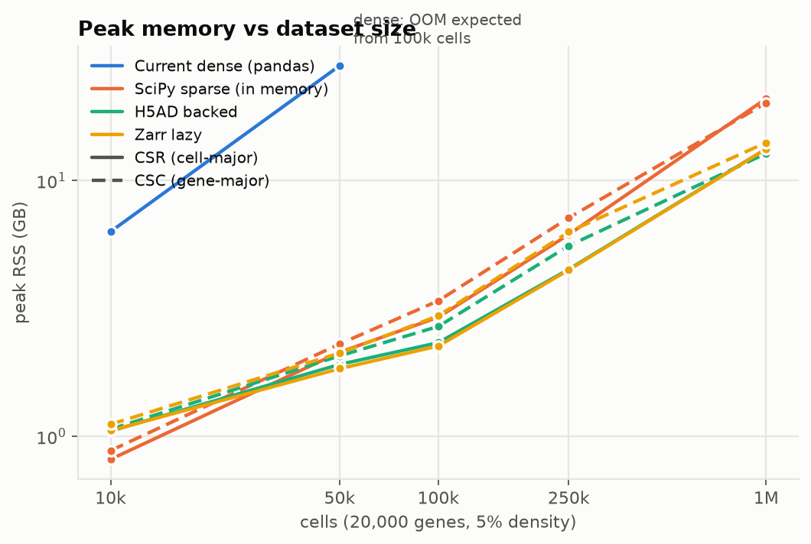
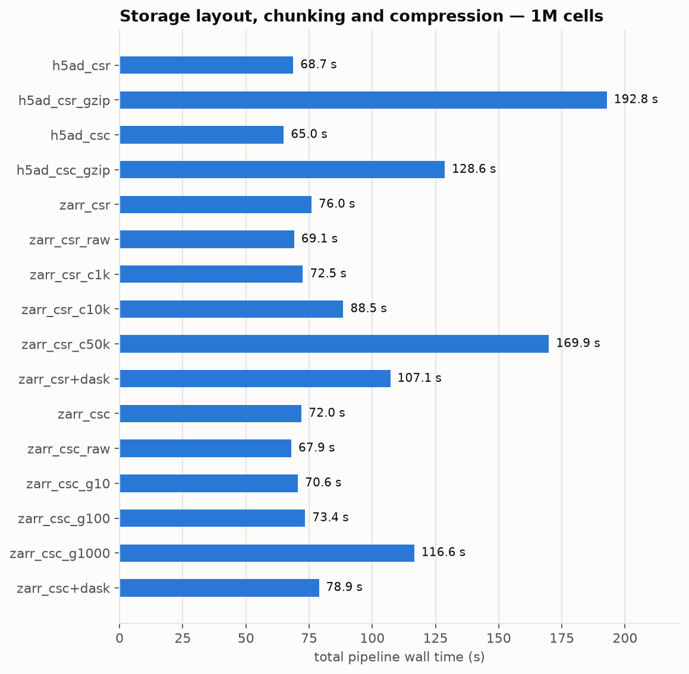
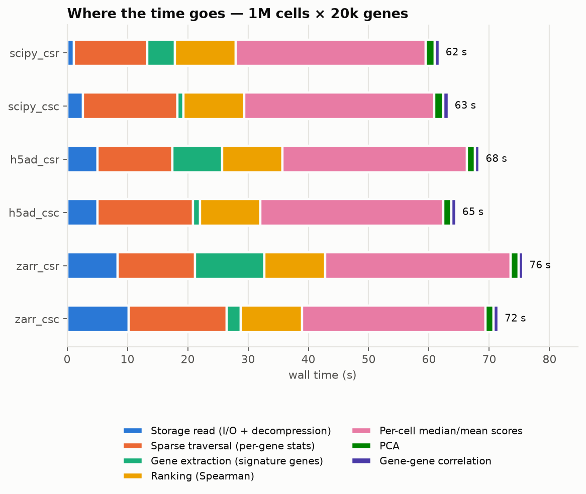
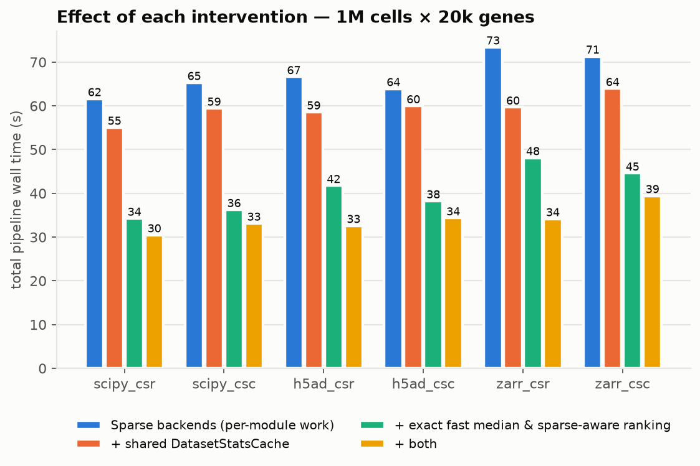
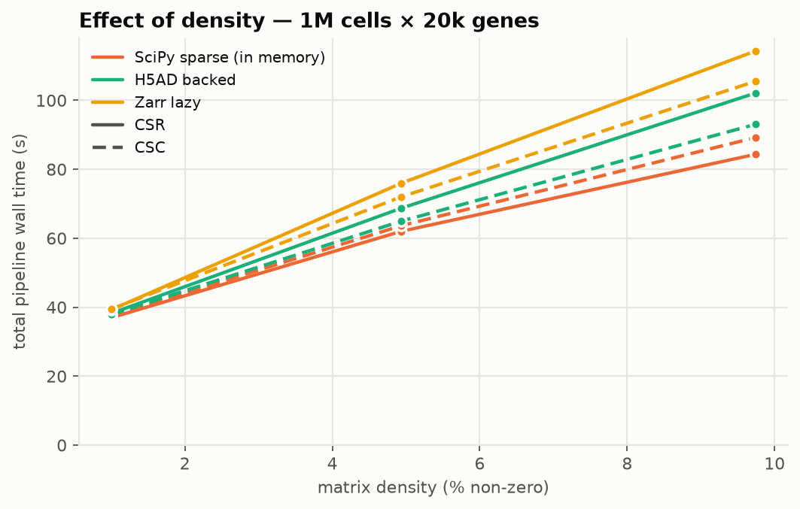
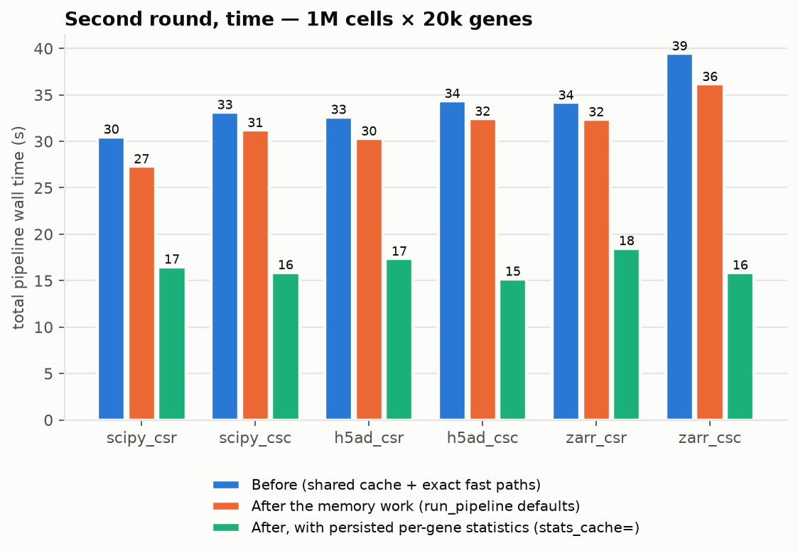
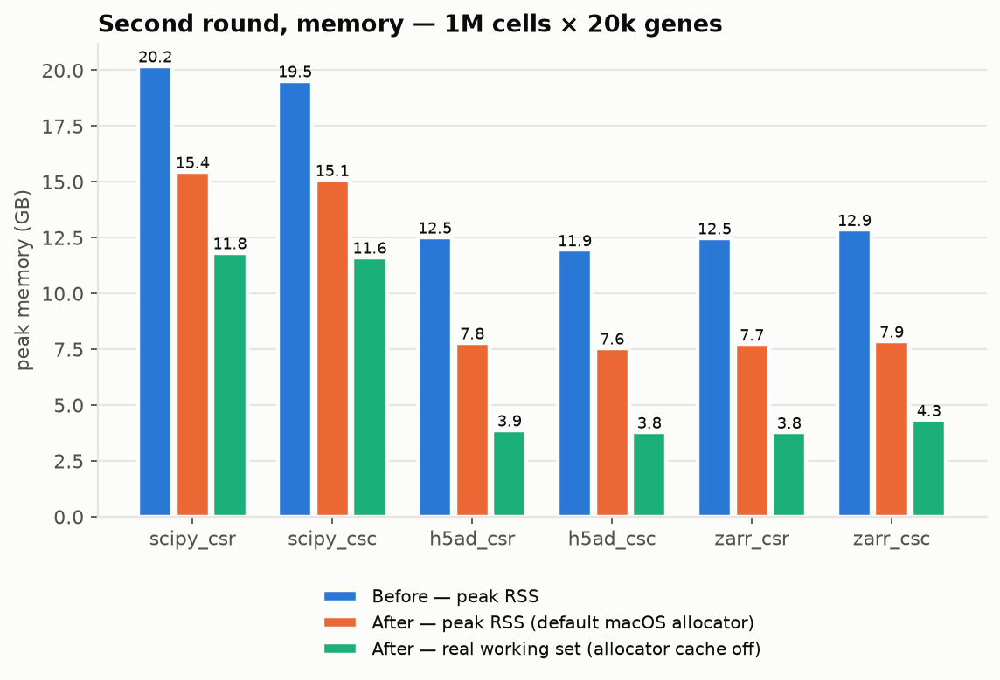

# pysigQC-metrics — Single-Cell Scalability Report

**Domanda.** H5AD/Zarr + algoritmi sparse-aware bastano per eseguire pysigQC su
100k–1M+ cellule con RAM e tempi ragionevoli, o resta un collo di bottiglia che
giustifica un analytics/storage engine specializzato?

**Risposta breve.** Bastano. Non costruire un engine custom.

* 1M cellule × 20k geni: **27–36 s, ~8 GB di picco RSS (4 GB di working set
  reale)** su H5AD/Zarr letti out-of-core, con i default di `run_pipeline`
  (la pipeline originale va in OOM già a 100k cellule). **15–18 s** dalla
  seconda analisi in poi sullo stesso dataset (`stats_cache=`).
  Dataset reale da 1.25M cellule × 35.5k geni (OneK1K): 35–46 s, 19–24 s.
* I 14 radar metrics sono **numericamente identici** al riferimento su tutti i
  backend: 237 run confrontati, 0 FAIL, scarto massimo assoluto 3.3·10⁻¹³.
  Per chi passa un DataFrame i risultati sono **bit-identici** al codice
  originale, con un terzo della memoria (100k cellule ora girano: 22 s, 18 GB).
* Il tempo residuo **non è storage**: I/O + decompressione valgono il 10–15%.
  Il resto è calcolo NumPy single-thread: metà è la scansione sparse per le
  statistiche di tutti i geni (evitabile persistendo 5 vettori di lunghezza
  *G* — prototipo misurato: **18 s**), metà è lavoro denso K×N sui soli geni
  delle signature (ranking, mediane, PCA), che nessun engine di storage
  accelererebbe.

Tutti i numeri vengono da [`benchmarks/results.csv`](benchmarks/results.csv);
metodo, comandi e caveat in [`benchmarks/README.md`](benchmarks/README.md).
Macchina: Apple Silicon, 18 core, 64 GB, SSD interno, page cache calda.

---

## Tabella riassuntiva (Definition of Done)

Sintetico, 20 000 geni, densità 5%, float32, 9 signature (20/50/100 geni, con
sovrapposizioni e geni mancanti; 408 geni unici, di cui 3 assenti dal dataset). Tempo totale della pipeline.

**Stato "sparse backend"** — solo Fasi 1–5 (nessuna cache condivisa, nessun fast path):

| Backend | 100k | 250k | 1M | Peak RAM 1M | Parità |
|---|---:|---:|---:|---:|---|
| Current dense (A) | OOM¹ | OOM¹ | OOM¹ | ≈ 580 GB¹ | reference |
| SciPy CSR (B) | 6.0 s | 14.9 s | 62.0 s | 20.9 GB | PASS |
| SciPy CSC (C) | 6.2 s | 15.6 s | 63.6 s | 20.1 GB | PASS |
| H5AD backed CSR (D) | 6.8 s | 16.6 s | 68.7 s | 13.3 GB | PASS |
| H5AD backed CSC (E) | 6.5 s | 16.1 s | 65.0 s | 12.8 GB | PASS |
| Zarr lazy CSR (F) | 7.5 s | 18.4 s | 76.0 s | 13.3 GB | PASS |
| Zarr lazy CSC (G) | 7.5 s | 18.0 s | 72.0 s | 14.1 GB | PASS |

**Stato finale** — `run_pipeline` con i suoi default (cache condivisa, fast
path esatti, interventi di memoria). Ultima colonna: stesso run dalla seconda
volta in poi, con le statistiche per-gene persistite (`stats_cache=`).

| Backend | 100k | 250k | 1M | Peak RSS 1M | Working set 1M² | 1M con `stats_cache` | Parità |
|---|---:|---:|---:|---:|---:|---:|---|
| SciPy CSR | 2.7 s | 6.6 s | 27.3 s | 15.4 GB | 11.8 GB | 16.5 s | PASS |
| SciPy CSC | 3.1 s | 7.5 s | 31.2 s | 15.1 GB | 11.6 GB | 15.9 s | PASS |
| H5AD backed CSR | 3.0 s | 7.2 s | 30.3 s | 7.8 GB | 3.9 GB | 17.4 s | PASS |
| H5AD backed CSC | 3.3 s | 8.1 s | 32.4 s | 7.6 GB | 3.8 GB | 15.2 s | PASS |
| Zarr lazy CSR | 3.1 s | 7.8 s | 32.4 s | 7.7 GB | 3.8 GB | 18.5 s | PASS |
| Zarr lazy CSC | 3.8 s | 9.1 s | 36.2 s | 7.9 GB | 4.3 GB | 15.9 s | PASS |

**Path DataFrame** (input denso, stesso codice pubblico di sempre):

| | 10k | 50k | 100k | 250k | Parità |
|---|---:|---:|---:|---:|---|
| Codice originale | 4.0 s / 6.3 GB | 28.9 s / 28.1 GB | OOM (58 GB) | OOM | reference |
| Oggi | 1.8 s / 2.8 GB | 10.0 s / 9.6 GB | 22.4 s / 18.0 GB | OOM atteso (45–55 GB) | **bit-identico** |

² Picco RSS con la cache dei blocchi grandi di libmalloc disattivata
(`MallocLargeCache=0`): su macOS l'allocatore tiene residenti i blocchi già
liberati e gonfia l'RSS di 3–4 GB; il working set è la memoria realmente
necessaria (il picco di allocazioni vive misurato con tracemalloc è 3.2 GB).

¹ `OOM_EXPECTED`: non eseguito. Il picco della pipeline attuale è 29 byte per
elemento della matrice (misurato: 6.3 GB a 10k cellule, 28.1 GB a 50k); a 100k
sono 58 GB, a 1M 580 GB. Ultima taglia eseguibile: **50k cellule, 28.9 s, 28.1 GB**.

Il tempo è lineare nel numero di cellule su tutti i backend (≈ 3 s per 100k
cellule nello stato finale). I due grafici mostrano lo stato "sparse backend".

---

## Cosa è stato fatto

1. **Baseline e profiling** del codice esistente, congelato in
   `benchmarks/reference_impl/` (commit `9b533b2`): è il riferimento di ogni
   confronto numerico e l'esperimento A.
2. **`ExpressionBackend`** (`pysigqc_metrics/backends.py`): vista logica
   genes × samples; `DenseBackend` (DataFrame — esegue il codice NumPy
   originale, risultati bit-identici), `SparseBackend` (scipy CSR/CSC, H5AD
   backed, Zarr, dask-lazy), `AnnDataBackend`. Mai una trasposizione o una
   densificazione dell'intera matrice. API pubblica invariata: i valori di
   `mRNA_expr_matrix` possono ora essere anche `AnnData` o un backend.
3. **`eval_var` / `eval_expr` sparse**: media, SD (ddof=1), conteggi NaN e
   sotto-soglia per gene con scansioni a chunk lungo l'asse maggiore (memoria
   limitata, indipendente dalla taglia). Zeri impliciti contati correttamente;
   NaN/Inf gestiti nel percorso sparse stesso (nessun percorso di compatibilità
   separato). **Mediana globale esatta** per conteggio: se cade fra gli zeri
   (caso single-cell tipico) servono solo i conteggi; altrimenti si
   partizionano i soli valori memorizzati del segno necessario.
4. **Signature-only densification** per `eval_compactness`,
   `compare_metrics`, `eval_stan`: si carica una volta l'unione dei geni delle
   signature e si densifica solo il blocco K×N della signature corrente.
   `rank_cache`, `sklearn.PCA`, `rankdata`/`corrcoef` invariati.
5. **`DatasetStatsCache`** (`run_pipeline(..., share_cache=True)`, opt-in),
   introdotta solo dopo i benchmark intermedi: 2 scansioni della matrice invece
   di 4–7.
6. **Due fast path esatti**, introdotti solo dopo che il profilo li ha
   indicati come costo dominante, entrambi bit-identici alla chiamata che
   sostituiscono e disattivabili (`PYSIGQC_EXACT_FAST_PATHS=0`):
   `np.median` + `nanmedian` sulle sole colonne con NaN; ranking sparse-aware
   (gli zeri sono un unico gruppo di ex aequo, si ordinano solo i non-zero).

7. **`share_cache=True` di default** e **statistiche per-gene persistite**
   (`run_pipeline(..., stats_cache=dir)`): dipendono solo dalla matrice, quindi
   vengono salvate in `<dir>/<dataset>.gene_stats.npz` (0.6 MB) e riusate dai
   run successivi con qualunque signature. Il file è validato da un'impronta
   della matrice (forma, dtype, nomi dei geni, digest dei primi e degli ultimi
   vettori) e ignorato con un warning se non corrisponde o è illeggibile.
8. **Memoria dei moduli K×N**, guidata da un profilo per riga di codice:
   `pca1_scores` era una *vista* `[:, 0]` che teneva in vita l'intera matrice
   N×K di ogni signature dentro i risultati (~4 GB a 1M cellule; difetto già
   presente nel codice originale) → ora è una copia della sola colonna;
   mediane per cella partizionate in place; `np.nanmean` sostituita da
   `np.mean` quando non ci sono NaN (evita una copia K×N incondizionata);
   z-transform in un solo buffer; `rank_cache` in float32 (i ranghi medi sono
   multipli di 0.5: esatti fino a 2²³ ≈ 8.4M cellule, oltre si torna a float64).
9. **Path DataFrame a blocchi di righe**: `eval_var`/`eval_expr` non fanno più
   una copia float64 dell'intera matrice (più altre due per la mediana), ma
   applicano le stesse chiamate NumPy a blocchi di geni; la mediana globale è
   esatta e calcolata nel dtype nativo. Da ~29 a ~9 byte per elemento.
   La bit-identità è garantita da una proprietà verificata su NumPy 1.26 e
   2.5: le riduzioni per riga non dipendono dal numero di righe del blocco,
   *tranne* per blocchi di una sola riga, che quindi non vengono mai prodotti.

Correttezza: 377 test (`tests/`), di cui 339 nuovi in `tests/test_backends.py`:
ogni backend contro il riferimento congelato su zeri, geni costanti, varianza
nulla, geni mancanti, signature sovrapposte, NaN, Inf, valori negativi,
mediana ≠ 0, soglia = 0 / > 0 / < 0, zeri espliciti memorizzati, layer
AnnData; `rtol=1e-10`, soglia confrontata con `atol=0`. In più: uguaglianza
**esatta** di tutti gli intermedi sul path DataFrame (6 tipi di frame: f32/f64,
layout C/F, interi, dtype misti; più dimensioni di blocco), con e senza cache,
con e senza fast path; file di statistiche stantio, corrotto, esteso a nuove
soglie. I test contro i reference output R passano invariati.

---

## Risposte alle nove domande

### 1. Quanto costa oggi la densificazione?

È *il* limite. La pipeline attuale tiene in vita fino a 29 byte per elemento
(DataFrame f32 + copia f64 + maschera NaN + copia `na.omit` + copia di lavoro
di `np.median`), con tre moduli che rifanno ciascuno `to_numpy()` dell'intera
matrice.

| Cellule (× 20k geni) | Tempo | Peak RSS |
|---:|---:|---:|
| 10 000 | 4.0 s | 6.3 GB |
| 50 000 | 28.9 s | 28.1 GB |
| 100 000 | — | ≈ 58 GB (OOM atteso) |
| 1 000 000 | — | ≈ 580 GB |

Tetto pratico del codice originale: ~22k cellule con 16 GB, ~46k con 32 GB,
~96k con 64 GB. Il path DataFrame di oggi usa ~9 byte per elemento (frame f32 +
il pool di valori per la mediana esatta): ~67k / ~135k / ~270k cellule.

### 2. Quanto guadagniamo semplicemente usando scipy sparse?

A parità di risultati, sul più grande dataset che il denso riesce a eseguire
(50k cellule): **28.9 s → 3.0 s (9.7×) e 28.1 GB → 2.1 GB (13×)**. Soprattutto
il limite si sposta da ~50k a milioni di cellule. Il guadagno viene dalla
sparsità e dalla densificazione dei soli geni delle signature, non dal formato
su disco: i backend out-of-core costano solo il 5–20% in più del sparse in RAM
e usano meno memoria (non tengono la matrice residente).

### 3. Quanto cambia CSR vs CSC?

Meno di quanto ci si aspetta: **±5% sul totale**, in entrambe le direzioni.

| 1M cellule, stato "sparse backend" | CSR | CSC |
|---|---:|---:|
| Estrazione geni delle signature (3 moduli) | 7.0 s (scansione completa ×3) | 0.2 s |
| Traversata per le statistiche di tutti i geni | 12.1 s | 15.8 s |
| Totale H5AD | 68.7 s | 65.0 s |

CSC rende quasi gratuito l'accesso per gene, ma pysigQC ha anche bisogno di
statistiche su *tutti* i geni, cioè di leggere comunque tutta la matrice, e lì
CSC costa di più (gli indici di gene vanno ricostruiti da `indptr`). Con la
cache condivisa l'estrazione su CSR viene fusa nella stessa scansione e CSR
diventa leggermente più veloce (32.6 vs 34.3 s). CSC vince nettamente solo
quando le statistiche per-gene sono già note (prototipo: 17.7 s CSC vs 20.7 s
CSR). **Non vale la pena convertire i dataset**: si usa il layout che c'è.

### 4. H5AD backed è abbastanza veloce?

Sì, *se non è compresso gzip*. H5AD backed non compresso: 30.3–32.4 s a 1M
cellule, entro il 10% dal sparse in RAM, con 7.7 GB di picco invece di 15.
La compressione invece conta molto:

| 1M cellule (stato "sparse backend") | Tempo | di cui lettura | Dimensione |
|---|---:|---:|---:|
| H5AD CSR, non compresso | 68.7 s | 5.1 s | 8.0 GB |
| H5AD CSR, gzip | 192.8 s | 68.3 s | 5.4 GB |
| H5AD CSC, non compresso | 65.0 s | 5.0 s | 7.9 GB |
| H5AD CSC, gzip | 128.6 s | 65.8 s | 5.0 GB |

Gli H5AD pubblici (es. CELLxGENE) sono tipicamente gzip con chunk HDF5 da
~10k elementi: sul COVID lung atlas il file *così come scaricato* richiede
6.5 s contro 2.4 s della sua riscrittura non compressa. Con la cache condivisa
il danno si riduce (si legge il file 2 volte invece di 4–7), ma la
raccomandazione resta: riscrivere una volta senza gzip, o in Zarr/zstd.

### 5. Zarr lazy è abbastanza veloce?

Sì: 32.4–36.2 s a 1M cellule con i default di anndata (zstd, sharding),
occupando il 20–40% in meno su disco dell'H5AD non compresso (5.0 GB CSR).
Tre avvertenze misurate:

* **Dimensione dei chunk rispetto alla scansione.** Chunk più grandi del
  blocco letto per volta causano amplificazione di lettura: CSR con chunk da
  50k cellule 169.9 s contro 72.5 s con chunk da 1k; CSC con chunk da 1000 geni
  116.6 s contro 70.6 s con 10 geni. Allineando il blocco di scansione al chunk
  (`chunk_nnz`) lo stesso file scende da 169.9 a 83.7 s. Chunk piccoli/medi
  (≤ 10k cellule o ≤ 100 geni) sono la scelta sicura.
* **Compressione zstd quasi gratuita**: 76.0 s contro 69.1 s non compresso.
* **`read_lazy` (dask)** funziona ed è verificato per parità, ma è più lento
  di `anndata.io.sparse_dataset`: 107.1 s (CSR) e 78.9 s (CSC) contro 76.0 e
  72.0 s. Usare dask solo se serve già altrove.

### 6. Quale modulo è il nuovo bottleneck?

Tolta la densificazione, nello stato "sparse backend" il più lento era
**`eval_stan`** (24 s su 62–76 a 1M), seguito da `compare_metrics` (14 s) e
`eval_compactness` (10 s): tutti e tre per operazioni NumPy sul blocco K×N,
identiche su ogni backend. Nello stato finale, a 1M cellule (H5AD CSR, 30.3 s):

| Voce | Tempo | Quota |
|---|---:|---:|
| Traversata sparse (statistiche di tutti i geni, 2 scansioni) | 10.6 s | 35% |
| Lettura storage (I/O + decompressione) | 3.9 s | 13% |
| `eval_stan`: z-transform + 2 mediane per cella | 5.6 s | 18% |
| Ranking Spearman (`eval_compactness` + score) | 5.2 s | 17% |
| `compare_metrics`: mediana/media per cella | 1.4 s | 5% |
| PCA | 1.2 s | 4% |
| Correlazione gene-gene | 0.7 s | 2% |
| Estrazione geni | 1.6 s | 5% |

Le prime due voci (48%) spariscono quando le statistiche sono persistite.

La densità sposta solo la parte di scansione: a 1M cellule 37 s all'1%, 62 s
al 5%, 84–114 s al 10% (stato "sparse backend"). Il lavoro K×N (~34 s prima
dei fast path, ~17 s dopo) è un pavimento indipendente dalla sparsità.

### 7. Massimo dataset processabile con 16 / 32 / 64 GB

Il picco in modalità backed **non dipende dalla matrice** (numero di geni,
densità) ma da cellule × dimensione delle signature: blocco denso K×N f64
(0.8 GB per 100 geni × 1M cellule), i suoi temporanei in PCA/correlazione e la
`rank_cache` float32 (1.6 GB per 405 geni × 1M cellule). Misurato nello stato
finale, picco RSS con l'allocatore di default: ≈ 1.7 GB + 6.1 GB per milione
di cellule (backed), ≈ 1.3 + 14.1 GB per milione (scipy in RAM, 5% di
densità). Estrapolazione lineare lasciando ~20% di RAM al sistema, per
signature fino a 100 geni:

| RAM | Codice originale | DataFrame oggi | SciPy in RAM | H5AD/Zarr backed |
|---|---:|---:|---:|---:|
| 16 GB | ~22k cellule | ~67k | ~0.8M | **~1.8M** |
| 32 GB | ~46k | ~135k | ~1.7M | **~3.9M** |
| 64 GB | ~96k | ~270k | ~3.5M | **~8M** |

Sono stime prudenti: su macOS l'RSS include 3–4 GB di blocchi già liberati che
l'allocatore tiene residenti; il working set reale a 1M cellule è 3.9 GB
(3.2 GB di allocazioni vive), cioè circa la metà. Verificato direttamente fino
a 1.25M cellule reali (8.9 GB di RSS backed); oltre è un'estrapolazione. Prima
del secondo giro di ottimizzazione le stesse colonne valevano ~0.6M–2.6M
(scipy) e ~1.0M–4.4M (backed).

### 8. Il limite è…

| Candidato | Verdetto a 1M cellule |
|---|---|
| Storage I/O | **No** — 4–7 s su 27–36 (page cache calda; a freddo + pochi secondi su SSD) |
| Decompressione | **Solo con gzip** (+60–125 s); zstd/Blosc ≈ gratis |
| Sparse traversal | **Sì, prima voce** (10–14 s): 2 passate su 10⁹ nnz con `bincount` single-thread. Evitata dal secondo run in poi con `stats_cache=`: dipende solo dalla matrice, il risultato sono 5 vettori di lunghezza G |
| Ranking | Secondario (5 s) dopo il ranking sparse-aware; era 10 s |
| Median calculation | La mediana *globale* è gratis (solo conteggi). Le mediane *per cella* (con lo z-transform) erano la voce n.1 (30 s); ora 7 s |
| PCA | No (1.2 s) — `sklearn.PCA` esatta può restare |
| Correlation | No (0.7 s) |
| Altro | **Memoria dei blocchi K×N** (dom. 7): dimezzata nel secondo giro, resta il primo limite al crescere delle cellule |

### 9. Esiste ancora un'opportunità concreta per un custom Single-Cell Analytics Engine?

**No, non per pysigQC.** Rispetto al criterio decisionale:

1. *Sparse/backed risolve l'OOM* — sì.
2. *Alcuni workload restano molto lenti* — **no**: 27–36 s a 1M cellule su
   standard esistenti; i casi lenti osservati (gzip, chunk disallineati)
   si risolvono scegliendo il layout, non costruendo un engine.
3. *Il profilo indica accesso/layout/calcolo ripetuto* — solo in parte, e la
   parte "calcolo ripetuto" si elimina *dentro* gli standard: persistendo le
   statistiche per-gene in un file `.npz` da 0.6 MB (`stats_cache=`), 1M
   cellule richiedono **15.2–15.9 s (CSC), 16.5–18.5 s (CSR)**, risultati
   bit-identici. Quel che resta sono ~15 s di algebra densa K×N single-thread
   che un engine di storage non tocca.

Nei termini dell'esempio della spec, il risultato non è "180 s → 10–20 s
ipotetici con un engine" ma "30 s al primo run, 15–18 s ai successivi, con un
file di statistiche accanto al dataset": non c'è un ordine di grandezza da
conquistare.

---

## Secondo giro di ottimizzazione (misurato prima/dopo)

I primi due interventi proposti in origine sono stati realizzati. "Prima" è lo
stato con cache condivisa e fast path; per il confronto di memoria il codice
"prima" è stato ricostruito e rimisurato nelle stesse condizioni (riproduce le
misure originali: 12.35 GB / 41.2 s).

| 1M cellule × 20k geni, H5AD backed CSR | Prima | Dopo |
|---|---:|---:|
| Tempo, default di `run_pipeline` | 41.2 s (cache opt-in) | 30.3 s |
| Tempo con statistiche persistite | — | 17.4 s |
| Peak RSS, allocatore macOS di default | 12.35 GB | 7.78 GB |
| Working set reale (`MallocLargeCache=0`) | 8.30 GB | 3.99 GB |
| Picco di allocazioni vive (tracemalloc) | 7.52 GB | 3.19 GB |

| DataFrame 50k cellule × 20k geni | Codice originale | Prima | Dopo |
|---|---:|---:|---:|
| Tempo | 28.9 s | 13–15 s | 10.0 s |
| Peak RSS | 28.1 GB | 29.4 GB | 9.6 GB |

Tutti i 30 run dello stato finale sono **bit-identici** ai corrispondenti run
"prima"; i run con statistiche persistite sono bit-identici a quelli senza.

## Prossimo intervento architetturale

1. **Parallelizzare per signature / per gene** il lavoro denso residuo
   (ranking, mediane, PCA sono indipendenti tra signature): su 18 core è il
   modo più diretto per scendere sotto i 10 s. Vale la pena solo per uso
   interattivo o batch di molti dataset.
2. **Un kernel compilato (numba) per la scansione sparse**, solo se il primo
   run su un dataset nuovo deve scendere sotto i ~30 s — non un engine.
3. **Linee guida di storage** (già nel README): niente gzip per analisi
   ripetute; Zarr/zstd o H5AD non compresso; chunk ≤ 10k cellule (CSR) o ≤ 100
   geni (CSC); nessuna necessità di convertire CSR↔CSC.
4. Oltre ~8M cellule i ranghi tornano a float64 e la `rank_cache` raddoppia:
   a quel punto converrà calcolare le correlazioni a blocchi di geni.

## Benchmark su dati reali

Dataset pubblici CELLxGENE, nessun filtro di cellule/geni, nessuna batch
correction; layer usato: `X`. Signature: 9 set curati (IFN, citotossicità,
G2/M, MHC-II, mieloide infiammatorio, ribosomiali, ipossia, B/plasma, linfoide
misto — con sovrapposizioni), mappati da simbolo a Ensembl via `var.feature_name`.

| Dataset | Forma | Densità | Preprocessing | Denso | Sparse backend | Stato finale | con `stats_cache` | Peak RSS (backed) |
|---|---|---:|---|---|---:|---:|---:|---:|
| COVID-19 lung atlas | 116 313 × 33 523 | 2.8% | nessuno (X già log-normalizzato dagli autori) | OOM atteso (113 GB) | 4.1–5.7 s | 2.2–3.3 s | — | 2.4–2.8 GB |
| OneK1K PBMC | 1 248 980 × 35 528 | 2.7% | normalizzazione a 10⁴ + log1p, in streaming | OOM atteso (1.3 TB) | 58.5–78.2 s | 35.0–46.2 s | 18.9–24.2 s | 8.9–11.1 GB |

Parità PASS fra tutti i backend su entrambi (riferimento: scipy CSR, dato che
il denso non è eseguibile). Le signature reali con geni molto espressi
(ribosomiali: righe > 50% non-zero) beneficiano meno del ranking sparse-aware,
che in quel caso ricade su `rankdata` completo.

## Limiti e note

* **Page cache calda** in tutte le misure (su macOS `purge` richiede root).
  A freddo si aggiunge al più dimensione-file / throughput del disco; su
  storage di rete il peso dello storage crescerebbe e il vantaggio delle 2
  scansioni (cache condivisa) con esso.
* Parte dei run è avvenuta di notte con il portatile a batteria e in sleep
  intermittente: i run coinvolti (stato finale OneK1K, varianti dask) sono
  risultati ~2× più lenti anche nei moduli di puro calcolo e sono stati
  **ripetuti** con alimentazione e macchina quieta; il report usa solo i
  valori ripetuti. La variabilità run-to-run a macchina quieta è del 2–5%.
* **RSS su macOS.** libmalloc tiene residenti i blocchi grandi già liberati:
  l'RSS riportato (anche nelle tabelle del primo giro) sovrastima il fabbisogno
  di 3–4 GB a 1M cellule. `benchmark_pipeline.py --no-malloc-cache` e
  `memory_probe.py --trace` misurano il working set reale. Su Linux (glibc) i
  blocchi grandi tornano subito al sistema e l'RSS è più vicino al working set.
* Le misure del secondo giro sono state fatte a batteria (97%), a macchina
  sveglia; i tempi sono coerenti con quelli misurati con alimentazione (es.
  OneK1K scipy CSR 35.0 s, contro 35.5–36.2 s prima degli interventi di memoria).
* Calcolo single-process; i thread BLAS sono ai default.
* **Comportamento preesistente, lasciato invariato:** una signature senza
  alcun gene presente nel dataset fa sollevare `ValueError` a
  `compute_compactness` (identico nel codice originale). È coperto da un test
  che ne verifica la parità; correggerlo è una decisione separata.
* Le metriche `prop_top_*` sono discrete (`cv >= quantile`): uno scarto di
  10⁻¹⁶ sul CV di un gene che coincide esattamente con il quantile potrebbe
  in teoria spostarle di 1/K. Non è mai successo in nessun run o test.
